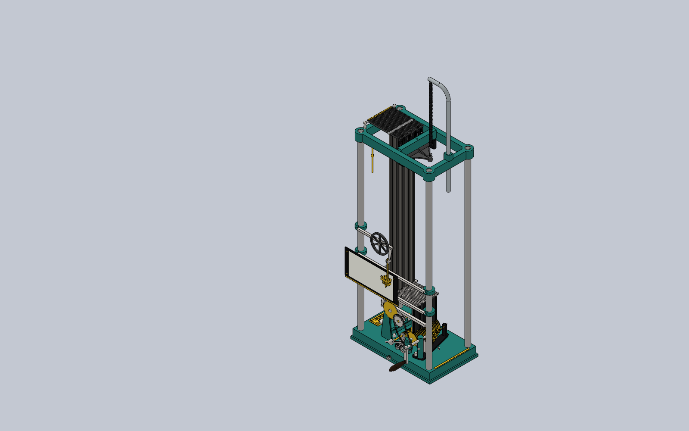
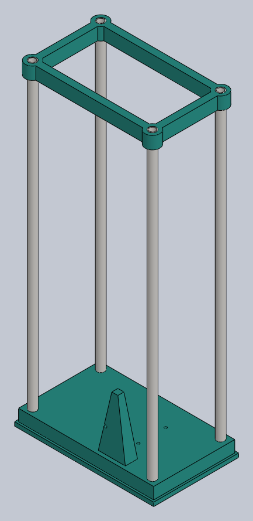
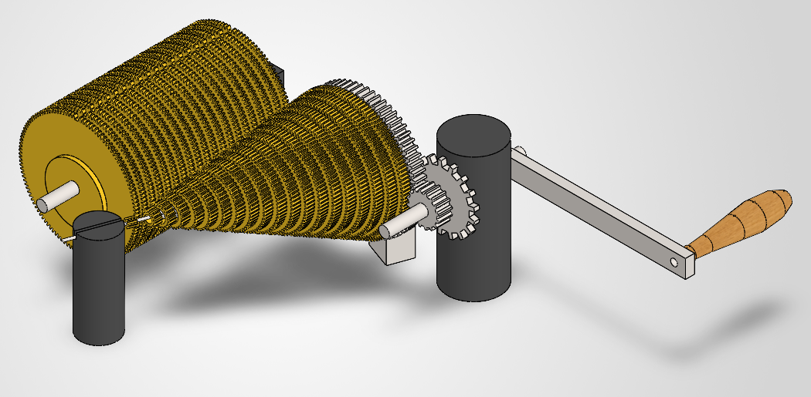
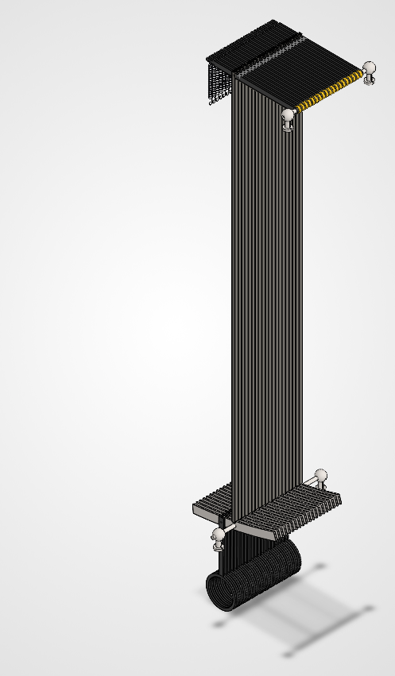
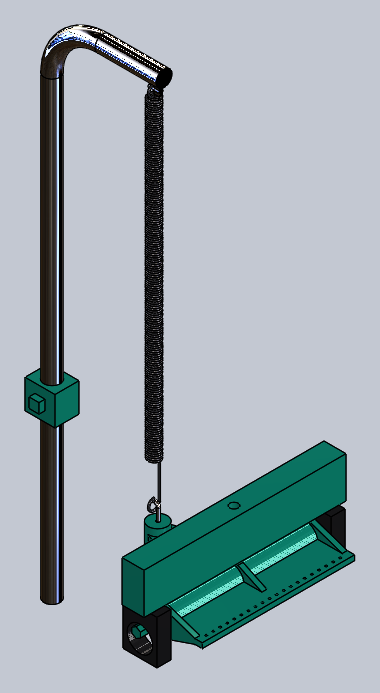
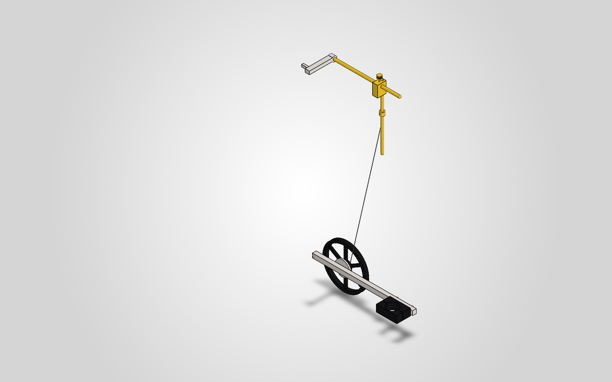
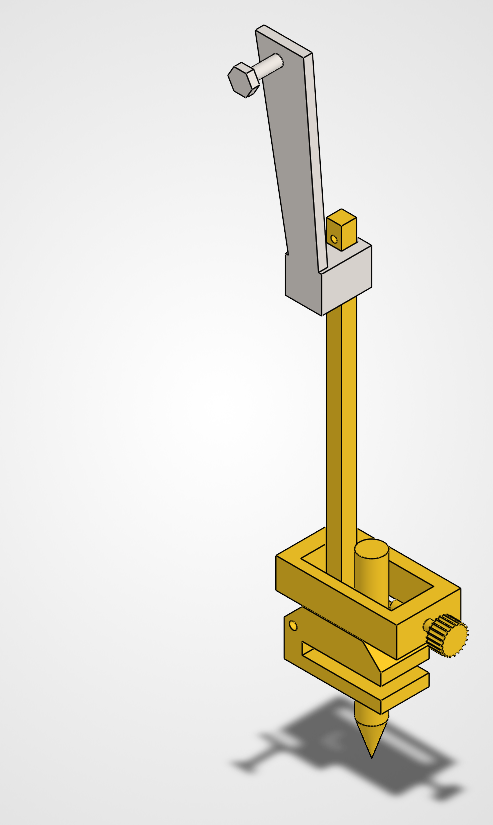
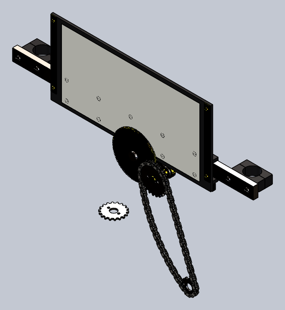

# Michelson Harmonic Analyzer (Recreation Project)

This repository documents the full reconstruction of Albert A. Michelson’s 20-element harmonic analyzer—an analog mechanical computer that performs Fourier synthesis and analysis via a system of gears, springs, levers, and cams.

<p align="center">
  
</p>

## 📐 Project Scope

This is a high-fidelity, didactic recreation of the original machine described in:

- *Albert Michelson’s Harmonic Analyzer: A Visual Tour of a Nineteenth Century Machine that Performs Fourier Analysis* by Bill Hammack, Steve Kranz, and Bruce Carpenter.
- EngineerGuy YouTube video series: ["A Machine That Uses Gears to Add Sines and Cosines"](https://www.youtube.com/playlist?list=PL2FF649D0C4407B30)

The project is designed as an advanced, hands-on learning experience in mechanical engineering, digital fabrication, and precision machining.

## 🧩 Components

The analyzer is composed of 20 mechanical channels operating in parallel, each contributing one sinusoidal term. Key subsystems include:

- Crank and translational gearing
- Cone gear set (variable frequency generation)
- Cylinder gear set (frequency transmission)
- Rocker arms and amplitude bars
- Summing lever and spring systems
- Magnifying and pen mechanism
- Platen (paper transport)

### CAD renders

| Frame | Drive train | Channels (×20) | Summing |
|:---:|:---:|:---:|:---:|
|  |  |  |  |

| Magnifier | Pen | Paper drive |
|:---:|:---:|:---:|
|  |  |  |

Every part and assembly is generated from **Python reproduction scripts** in
[`cad/scripts/`](./cad/scripts) that drive SolidWorks over its COM API (via the
[`SolidworksMCP-python`](https://github.com/pedropaulovc/SolidworksMCP-python) adapter). The
scripts are the source of truth; the `.sldprt`/`.sldasm` files and renders are build
artefacts and are **not** versioned — regenerate them with `doit` (see below).
Binaries are snapshotted only at tagged releases.

## 🏗️ Building the model

The model is generated headlessly from a clean checkout. SolidWorks must be installed and
running (launched via the 3DEXPERIENCE desktop shortcut, not `sldworks.exe` directly).

The **entire** pipeline — build → verify → export → release — is one
[`doit`](https://pydoit.org) graph (`dodo.py` at the repo root). doit hashes
script + config content (immune to git/worktree mtime churn) to decide what is stale,
and propagates a part → assembly dependency DAG. When only a part changed, the dependent
assembly is **refreshed** (reopen + per-config `ForceRebuild3` + health/DOF/interference
gates + in-place save — seconds) instead of rebuilt from scratch (re-insert + re-mate ~122
components — ~500 s). A refresh that hits a dangling mate, free DOF, or interference **fails
loud** (non-zero exit, the `.SLDASM` left untouched).

Tasks are grouped by whether they need SolidWorks — the prefix tells you at a glance:

| group | needs SW? | what it does |
|-------|:---:|--------------|
| `part:<stem>` / `assembly:<stem>` | yes | build/refresh a part or assembly |
| `verify:soundness` / `verify:kinematics` | yes | DOF/interference/health gates per (sub)assembly · motion-study pen sweep (gear-ratios verified at release preflight) |
| `check:math` / `check:config` / `check:graph` / `check:nameplate` / `check:recipe` | **no** | Fourier math · config audit · pure-python unit tests |
| `export` | yes | neutral STEP/STL + scene-graph export |
| `release` | yes | Pack-and-Go + exports + diff + GitHub release (opt-in) |
| **`build`** | yes | **every** part + assembly + **every** gate — the one fully-safe entry |
| `build_bare` | yes | parts + assemblies only — a quick rebuild |

One-off: install the build deps —
`…\.venv\Scripts\python.exe -m pip install doit pillow pytest`.

```powershell
$py = "C:\src\SolidworksMCP-python\.venv\Scripts\python.exe"

# The one fully-safe build: every part + assembly + every gate (= default task)
& $py -m doit

# Same, but fan the SolidWorks-free check:* gates out across 4 workers while the
# COM build/verify stream stays serial (safe -- see "Parallelism" below)
& $py -m doit -n 4

# Quick rebuild -- parts + assemblies only, no gates or export
& $py -m doit build_bare

# Just one part (doit selection does NOT run reverse dependents -- the dependent
# .SLDASM/renders stay stale until you run plain `doit` or select them explicitly)
& $py -m doit part:cone_gear

# Just one assembly (+ its stale prerequisites), or a single gate
& $py -m doit assembly:paper_drive
& $py -m doit verify:soundness        # one SW gate
& $py -m doit check:math              # one offline gate

# Neutral export, then cut a release (args after `--`; opt-in)
& $py -m doit export
& $py -m doit release -- v0.2.0

# Inspect the graph / clean
& $py -m doit list --all
& $py -m doit clean
```

**Parallelism.** There is one SolidWorks STA seat, so COM work must stay serial — but
the SolidWorks-*free* `check:*` gates need not. `dodo.py` chains every COM task into a
single linear `task_dep` **spine**, so at most one COM task is ever runnable: the seat is
never contended **even under `-n N`**, while `check:*` tasks fan out in parallel. (This
replaces the old "never pass `-n`" rule — `-n` is now safe.) Tradeoff: a COM failure
mid-spine skips the later COM tasks in that run; fix and re-run (doit re-runs only what is
still stale). Outputs land in `cad/out/` (gitignored).

**Force a full from-scratch rebuild of one assembly** (bypass the cheap refresh) by deleting
its target — a missing target makes doit take the FULL branch (hooks included):

```powershell
del cad\out\sldasm\paper-drive.SLDASM
& $py -m doit assembly:paper_drive
```

### Repository layout

```
cad/
  scripts/        Python reproduction scripts (build_<part>.py, build_<sub>_assembly.py),
                  shared helpers (_common.py, _gear.py, _chain.py); refresh_assembly.py,
                  _buildgraph.py (the doit build graph lives in dodo.py at the repo root)
  scripts/diagnostics/   archived one-off probe/diag scripts (not part of the build)
  config/         YAML source-of-truth for parametrics, tolerances, materials (data layer)
  DIMENSIONS.md   dimension provenance (book/photo source + confidence per dim)
  out/            generated artefacts — gitignored, regenerated by doit (dodo.py)
comparisons/      photo-vs-CAD alignment + render pipeline (manifest-driven)
docs/             design policies: motion, tolerance, assumptions, known limitations
references/       source book, video keyframes, manuals (git submodule)
research/         per-phase research notes
dodo.py           doit build graph (part→assembly DAG; refresh vs full rebuild)
```

### Toolchain (pinned)

A book supplement must reproduce for years, so the toolchain is pinned like a compiler:

- **SolidWorks**: 3DEXPERIENCE for Makers, **R2026x** — the COM API surface and file format
  change yearly; readers need a compatible release.
- **Python**: the `SolidworksMCP-python` venv (always `uv` + venv, never `--system`).

## 🛠️ Implementation Plan

The implementation follows a structured seven-phase process:

| Phase | Duration | Description |
|-------|----------|-------------|
| 1. Research & Documentation | 2 weeks | Study source materials, identify mechanical principles |
| 2. Preliminary Design        | 3 weeks | Create core CAD assemblies of gears, linkages |
| 3. Detailed CAD Modeling     | 4 weeks | Full-featured models with tolerances and annotations |
| 4. Manufacturing             | 6 weeks | CNC machining, lathe work, and parts procurement |
| 5. Assembly & Calibration    | 4 weeks | Physical build-up and iterative tuning |
| 6. Testing & Validation      | 3 weeks | Compare machine output with known Fourier series |
| 7. Publication               | 2 weeks | Prepare final documentation and make it open-source |

Research notes per phase: [`research/`](./research)

## 🔧 Tooling and Capabilities

This project is built using:

- **CAD**: SOLIDWORKS 3DEXPERIENCE for Makers (R2026x), scripted via the COM API in Python
- **Machinery**: 
  - Mill: PM-30MV (1 HP, R8, 4000 RPM)
  - Lathe: JET BD-920N (9″ × 20″)
- **Manufacturing Methods**: Manual milling/turning, custom jigs, DROs, hand finishing.

## 📚 References

- Hammack, Kranz, Carpenter. *Albert Michelson’s Harmonic Analyzer*. Articulate Noise Books, 2014.
- Michelson & Stratton. "A New Harmonic Analyzer", American Journal of Science, 1898.
- EngineerGuy YouTube Series [Playlist](https://www.youtube.com/playlist?list=PL2FF649D0C4407B30)

## 🔓 License

All original documentation, code, and CAD files are released under the [MIT License](./LICENSE). Reuse of book content or video transcripts must respect original copyright.

