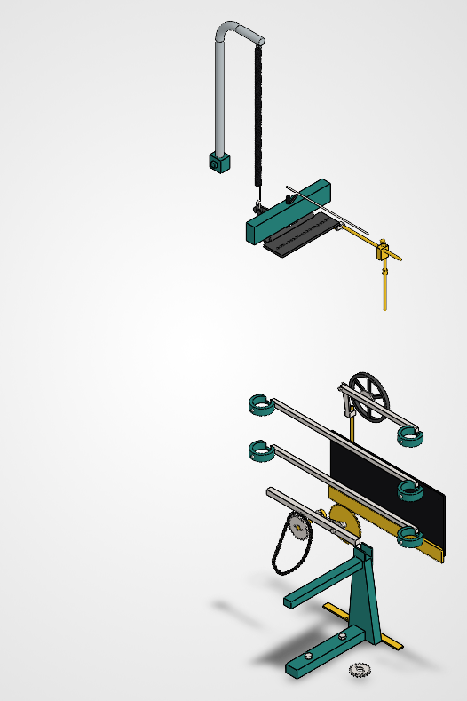

# Michelson Harmonic Analyzer (Recreation Project)

This repository documents the full reconstruction of Albert A. Michelson’s 20-element harmonic analyzer—an analog mechanical computer that performs Fourier synthesis and analysis via a system of gears, springs, levers, and cams.

<p align="center">
  
</p>

## 📐 Project Scope

This is a high-fidelity, didactic recreation of the original machine described in:

- *Albert Michelson’s Harmonic Analyzer: A Visual Tour of a Nineteenth Century Machine that Performs Fourier Analysis* by Bill Hammack, Steve Kranz, and Bruce Carpenter.
- EngineerGuy YouTube video series: ["A Machine That Uses Gears to Add Sines and Cosines"](https://www.youtube.com/playlist?list=PL2FF649D0C4407B30)

The project is designed as an advanced, hands-on learning experience in mechanical engineering, digital fabrication, and precision machining.

## 🧩 Components

The analyzer is composed of 20 mechanical channels operating in parallel, each contributing one sinusoidal term. Key subsystems include:

- Crank and translational gearing
- Cone gear set (variable frequency generation)
- Cylinder gear set (frequency transmission)
- Rocker arms and amplitude bars
- Summing lever and spring systems
- Magnifying and pen mechanism
- Platen (paper transport)

### CAD renders

| Frame | Drive train | Channels (×20) | Output |
|:---:|:---:|:---:|:---:|
|  |  |  |  |

Every part and assembly is generated from **Python reproduction scripts** in
[`cad/scripts/`](./cad/scripts) that drive SolidWorks over its COM API (via the
[`SolidworksMCP-python`](https://github.com/pedropaulovc/SolidworksMCP-python) adapter). The
scripts are the source of truth; the `.sldprt`/`.sldasm` files and renders are build
artefacts and are **not** versioned — regenerate them with `build_all.py` (see below).
Binaries are snapshotted only at tagged releases.

## 🏗️ Building the model

The model is generated headlessly from a clean checkout. SolidWorks must be installed and
running (launched via the 3DEXPERIENCE desktop shortcut, not `sldworks.exe` directly).

```powershell
# Full rebuild from empty (≈40 min): every part, then the 4 subassemblies, then the top assembly
C:\src\SolidworksMCP-python\.venv\Scripts\python.exe cad\scripts\build_all.py --clean

# Rebuild just one part/assembly and everything that depends on it
C:\src\SolidworksMCP-python\.venv\Scripts\python.exe cad\scripts\build_all.py --rebuild cone_gear
```

`build_all.py` checkpoints: a script is skipped when its artefact already exists, so a crashed
run resumes where it stopped. Outputs land in `cad/out/` (gitignored).

### Repository layout

```
cad/
  scripts/        Python reproduction scripts (build_<part>.py, build_<sub>_assembly.py),
                  shared helpers (_common.py, _gear.py, _chain.py), build_all.py orchestrator
  scripts/diagnostics/   archived one-off probe/diag scripts (not part of the build)
  config/         YAML source-of-truth for parametrics, tolerances, materials (data layer)
  DIMENSIONS.md   dimension provenance (book/photo source + confidence per dim)
  out/            generated artefacts — gitignored, regenerated by build_all.py
comparisons/      photo-vs-CAD alignment + render pipeline (manifest-driven)
docs/             design policies: motion, tolerance, assumptions, known limitations
references/       source book, video keyframes, manuals (git submodule)
research/         per-phase research notes
```

### Toolchain (pinned)

A book supplement must reproduce for years, so the toolchain is pinned like a compiler:

- **SolidWorks**: 3DEXPERIENCE for Makers, **R2026x** — the COM API surface and file format
  change yearly; readers need a compatible release.
- **Python**: the `SolidworksMCP-python` venv (always `uv` + venv, never `--system`).

## 🛠️ Implementation Plan

The implementation follows a structured seven-phase process:

| Phase | Duration | Description |
|-------|----------|-------------|
| 1. Research & Documentation | 2 weeks | Study source materials, identify mechanical principles |
| 2. Preliminary Design        | 3 weeks | Create core CAD assemblies of gears, linkages |
| 3. Detailed CAD Modeling     | 4 weeks | Full-featured models with tolerances and annotations |
| 4. Manufacturing             | 6 weeks | CNC machining, lathe work, and parts procurement |
| 5. Assembly & Calibration    | 4 weeks | Physical build-up and iterative tuning |
| 6. Testing & Validation      | 3 weeks | Compare machine output with known Fourier series |
| 7. Publication               | 2 weeks | Prepare final documentation and make it open-source |

Research notes per phase: [`research/`](./research)

## 🔧 Tooling and Capabilities

This project is built using:

- **CAD**: SOLIDWORKS 3DEXPERIENCE for Makers (R2026x), scripted via the COM API in Python
- **Machinery**: 
  - Mill: PM-30MV (1 HP, R8, 4000 RPM)
  - Lathe: JET BD-920N (9″ × 20″)
- **Manufacturing Methods**: Manual milling/turning, custom jigs, DROs, hand finishing.

## 📚 References

- Hammack, Kranz, Carpenter. *Albert Michelson’s Harmonic Analyzer*. Articulate Noise Books, 2014.
- Michelson & Stratton. "A New Harmonic Analyzer", American Journal of Science, 1898.
- EngineerGuy YouTube Series [Playlist](https://www.youtube.com/playlist?list=PL2FF649D0C4407B30)

## 🔓 License

All original documentation, code, and CAD files are released under the [MIT License](./LICENSE). Reuse of book content or video transcripts must respect original copyright.

