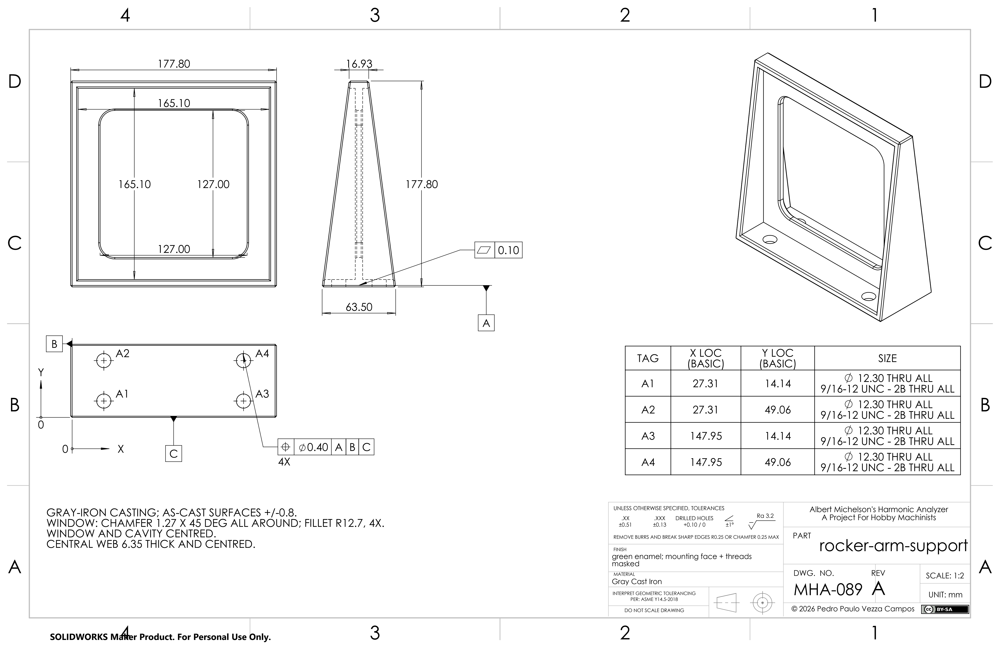
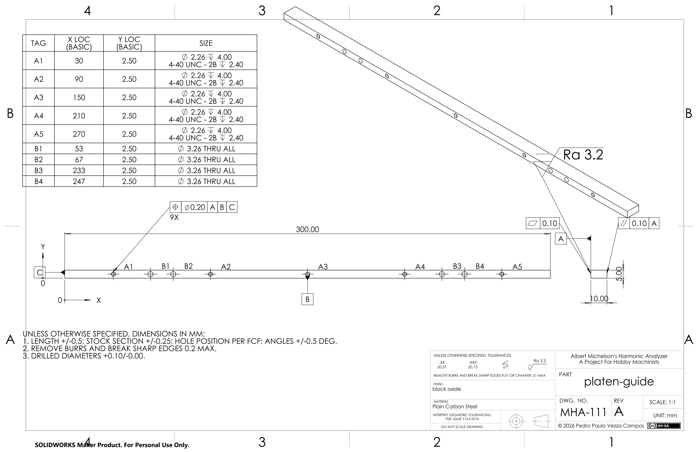

<h1 align="center">Michelson's Harmonic Analyzer</h1>

<p align="center">
  <em>A machine that adds twenty sine waves together using gears, cams, springs and levers.<br>
  Built in 1898. Never documented. We're writing the plan.</em>
</p>

<p align="center">
  
</p>

<p align="center">
  <b><a href="kickstarter/README.md">📣 Kickstarter</a></b> ·
  <b><a href="book/README.md">📖 The book</a></b> ·
  <b><a href="logbook/README.md">🔧 Learning log</a></b> ·
  <b><a href="web/README.md">🖥️ Simulator</a></b> ·
  <b><a href="ai-story/README.md">🤖 Built with AI</a></b>
</p>

---

Turn the crank and this machine performs Fourier synthesis: twenty weighted
cosines, summed by twenty springs pulling on a knife-edge lever, drawn as a
continuous curve by a pen. Set it up differently and it runs backwards, doing
Fourier *analysis* — the operation Michelson himself said involved "so much
mathematics that I shall not undertake it here."

One survives, in a glass case at the University of Illinois. There has never
been a plan for building another.

**This repository is that plan.** ~115 parts modelled in SolidWorks — generated
from Python, verified on every build, checked against photographs of the real
machine — and a book being written to turn them into chips on a shop floor.

## Where it is now

| Frame | Drive train | Channels (×20) | Summing |
|:---:|:---:|:---:|:---:|
|  |  |  |  |

| Magnifier | Pen | Paper drive |
|:---:|:---:|:---:|
|  |  |  |

Production drawings, too — the release bundle ships a sheet per part:

| Rocker-arm support | Platen guide |
|:---:|:---:|
|  |  |

Every part and assembly is generated by **Python reproduction scripts** in
[`cad/scripts/`](./cad/scripts) driving SolidWorks over its COM API. The scripts
are the source of truth; the `.sldprt`/`.sldasm` files and renders are build
artefacts, regenerated by `doit` and snapshotted only at
[tagged releases](../../releases).

Every dimension is traced to a source — a book page, a photograph, or a
derivation — with a confidence level. Every assembly is gated on degrees of
freedom, interference and mass properties before it can be saved. And the whole
model is scored against Hammack, Kranz and Carpenter's photographs of the
surviving machine, pair by pair, on every export.

## The five things being built

| | | |
|---|---|---|
| 📣 | **[Kickstarter](kickstarter/README.md)** | Funding the build and the book. Pre-launch. |
| 📖 | **[The book](book/README.md)** | *A Project for Hobby Machinists* — every part, every setup, every cut, on a manual mill and lathe. The main deliverable. |
| 🔧 | **[Learning log](logbook/README.md)** | I'm a software engineer who has never cut metal. Twelve modules of lathe and mill, each ending by making a real part of the machine. The book is written from this. |
| 🖥️ | **[Simulator](web/README.md)** | The machine in your browser, running on the exported CAD model, paced like the engineerguy videos. |
| 🤖 | **[Built with AI](ai-story/README.md)** | An honest account of using LLM agents for all of this — with receipts, including the failures. |

## The hard parts (we already know which they are)

A per-part manufacturability pass ([`docs/machining-dfm.md`](docs/machining-dfm.md))
found three parts carrying essentially all the risk:

- **A six-tooth gear, ~4 mm across, with a 0.49 mm wall** at the tooth root over
  a 0.79 mm bore. The hardest part in the machine.
- **A knife edge** — the precision interface of the whole instrument — sitting on
  a hex trunnion cantilevered 21.7 mm off an organic cast lever.
- **A Ø0.79 × 34 mm journal in steel**, 43:1 slenderness. Whip city.

And one settled finding that shapes the whole build: **off-the-shelf involute
cutters for this gear train's pitch do not exist.** You make your own.

## Build the model yourself

Needs a SolidWorks seat. Full instructions in
**[`docs/BUILDING.md`](docs/BUILDING.md)**.

```powershell
git submodule update --init --recursive
uv sync
uv run python -m doit          # every part + assembly + every gate
```

No seat? The offline gates still run (`uv run python -m doit check:math`), and
every release ships the STEP/STL/glTF exports and drawing PDFs.

## References

- Hammack, Kranz & Carpenter, *Albert Michelson's Harmonic Analyzer: A Visual
  Tour of a Nineteenth Century Machine that Performs Fourier Analysis*
  (Articulate Noise Books, 2014) — **free to read**, and the reason this project
  exists.
- engineerguy, ["A Machine That Uses Gears to Add Sines and Cosines"](https://www.youtube.com/playlist?list=PL2FF649D0C4407B30)
- Michelson & Stratton, "A New Harmonic Analyzer", *American Journal of Science*
  25 (1898): 1–13.

This project is independent of, and not endorsed by, those authors or the
University of Illinois.

## License

Code, CAD and documentation: [MIT](./LICENSE). Reuse of the source book's
content or the video transcripts must respect their original copyright.
