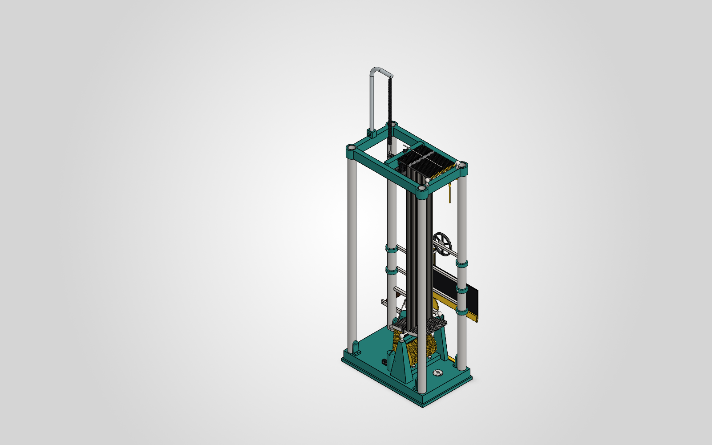
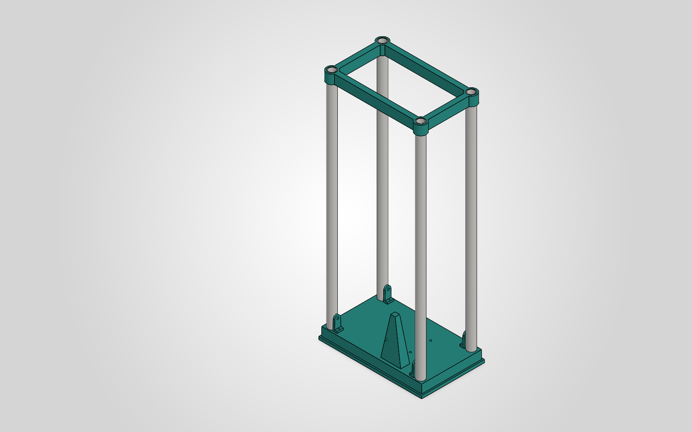
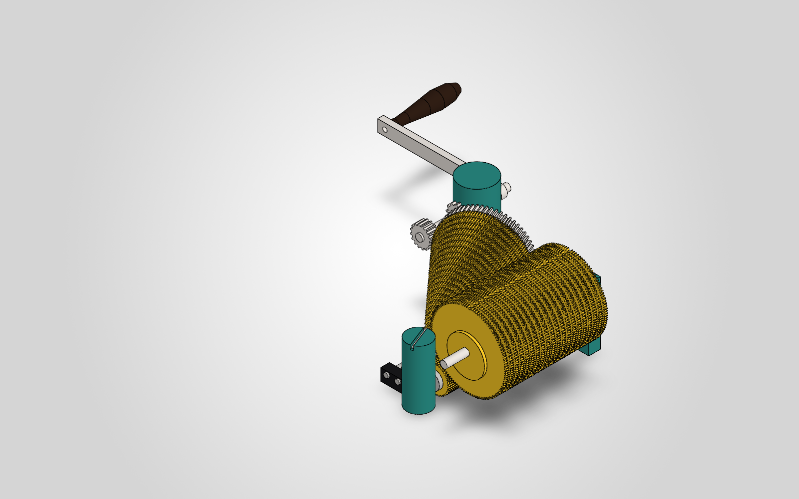
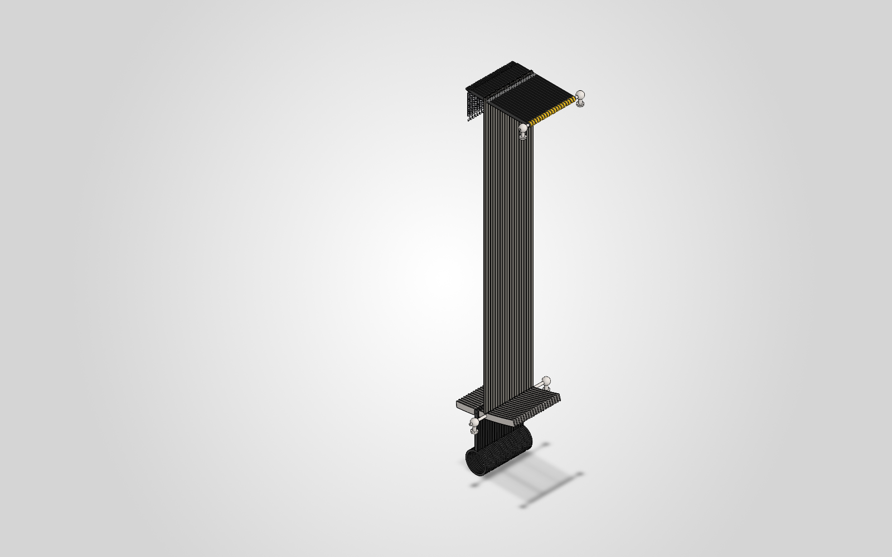
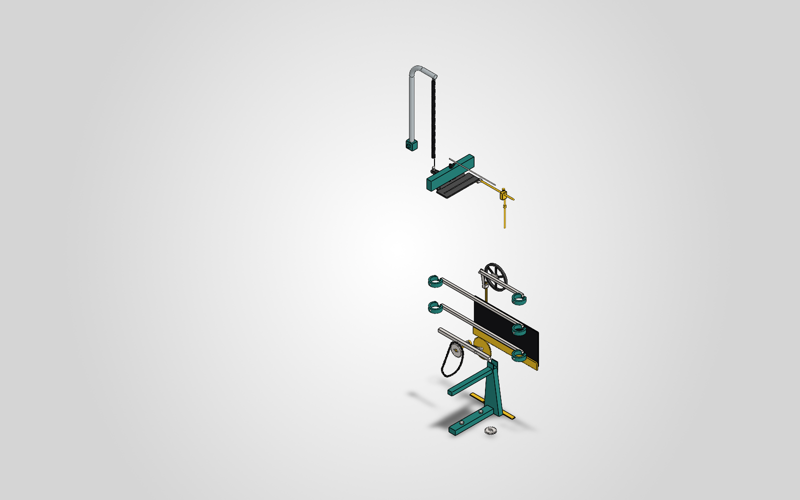

# Michelson Harmonic Analyzer (Recreation Project)

This repository documents the full reconstruction of Albert A. Michelson’s 20-element harmonic analyzer—an analog mechanical computer that performs Fourier synthesis and analysis via a system of gears, springs, levers, and cams.

  

## 📐 Project Scope

This is a high-fidelity, didactic recreation of the original machine described in:

- *Albert Michelson’s Harmonic Analyzer: A Visual Tour of a Nineteenth Century Machine that Performs Fourier Analysis* by Bill Hammack, Steve Kranz, and Bruce Carpenter.
- EngineerGuy YouTube video series: ["A Machine That Uses Gears to Add Sines and Cosines"](https://www.youtube.com/playlist?list=PL2FF649D0C4407B30)

The project is designed as an advanced, hands-on learning experience in mechanical engineering, digital fabrication, and precision machining.

## 🧩 Components

The analyzer is composed of 20 mechanical channels operating in parallel, each contributing one sinusoidal term. Key subsystems include:

- Crank and translational gearing
- Cone gear set (variable frequency generation)
- Cylinder gear set (frequency transmission)
- Rocker arms and amplitude bars
- Summing lever and spring systems
- Magnifying and pen mechanism
- Platen (paper transport)

### CAD renders

| Frame | Drive train | Channels (×20) | Output |
|:---:|:---:|:---:|:---:|
|  |  |  |  |

All SolidWorks models are generated from C# scripts in [`cad/`](./cad). Build artefacts—per-part renders, eight standard views of the full machine, STEP/STL exports, and the BOM—live in [`cad/out/`](./cad/out).

## 🛠️ Implementation Plan

The implementation follows a structured seven-phase process:

| Phase | Duration | Description |
|-------|----------|-------------|
| 1. Research & Documentation | 2 weeks | Study source materials, identify mechanical principles |
| 2. Preliminary Design        | 3 weeks | Create core CAD assemblies of gears, linkages |
| 3. Detailed CAD Modeling     | 4 weeks | Full-featured models with tolerances and annotations |
| 4. Manufacturing             | 6 weeks | CNC machining, lathe work, and parts procurement |
| 5. Assembly & Calibration    | 4 weeks | Physical build-up and iterative tuning |
| 6. Testing & Validation      | 3 weeks | Compare machine output with known Fourier series |
| 7. Publication               | 2 weeks | Prepare final documentation and make it open-source |

Research notes per phase: [`research/`](./research)

## 🔧 Tooling and Capabilities

This project is built using:

- **CAD**: SOLIDWORKS xDesign for Makers
- **Machinery**: 
  - Mill: PM-30MV (1 HP, R8, 4000 RPM)
  - Lathe: JET BD-920N (9″ × 20″)
- **Manufacturing Methods**: Manual milling/turning, custom jigs, DROs, hand finishing.

## 📚 References

- Hammack, Kranz, Carpenter. *Albert Michelson’s Harmonic Analyzer*. Articulate Noise Books, 2014.
- Michelson & Stratton. "A New Harmonic Analyzer", American Journal of Science, 1898.
- EngineerGuy YouTube Series [Playlist](https://www.youtube.com/playlist?list=PL2FF649D0C4407B30)

## 🔓 License

All original documentation, code, and CAD files are released under the [MIT License](./LICENSE). Reuse of book content or video transcripts must respect original copyright.

