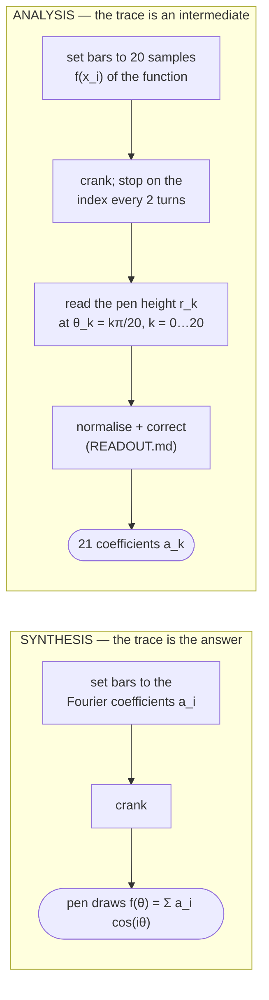

# Operating the analyzer — what the trace is, and what the operator does with it

This is the operator's view of the machine: the two modes, what each produces, and
why the analysis mode ends with pencil-and-paper arithmetic rather than a number
read straight off the pen. It exists because that arithmetic is easy to miss — the
2014 book and the video series present the traces, and the 1898 paper states the
procedure in one sentence — yet it is the step that most of the machine's accuracy
lives in. The release ships the step-by-step form of it as `READOUT.md` (generated
by `error_budget.py --procedure`) with this page beside it under `docs/`; this document
is the *why* behind that file, and `READOUT.md` points back here.

**None of this is new.** Every step below is Michelson's own practice, cited to the
1898 paper or the 2014 book where it appears. What the error budget adds is the
*size* of each step's effect, so the operator knows which ones matter and why the
drawings carry the tolerances they do.

## Two modes, one mechanism

The mechanism is fixed: 20 gears turn 20 eccentric cams; each cam rocks an arm; a
bar set at station $d_i$ along that arm scales the motion; 20 springs sum the
motions on a lever; a magnifier draws the sum with a pen. The 80-turn crank makes
gear $i$ turn $i/80$ of a revolution per crank turn, so at crank angle $\theta$ the
pen draws

$$
y(\theta) \propto \sum_{i=1}^{20} x_i \cos(i\theta),
$$

with $x_i$ proportional to the station of bar $i$. Which *question* the trace answers
depends only on what the operator put on the bars (book p. 8, "Fourier Analysis";
1898 pp. 9–10).

### Synthesis: the plot is the product

Set the bars to the coefficients, crank, keep the paper. Nothing is read
numerically, so nothing is normalised or corrected. The machine's own distortions
(next section) are in the ink, and at pen scale they are a few tenths of a
millimetre on a 15 mm half-stroke — invisible. Every trace in the book's "Output
from the machine" section (pp. 75–89) and in the 1898 paper's Figures 2–10 was made
this way, and none of them was post-processed.

### Analysis: the pen draws a *curve of coefficients*, and the operator reads it

Michelson's description of the analysis mode (1898, p. 10, with the machine's
$m = 80$ elements):

> "the lower ends of the vertical rods $R$ are moved along the levers $B$ to
> distances proportional to the ordinates of the curve $y = f(n\alpha)$. The curve
> thus obtained for $a_k$ is a *continuous* function of $k$ … To obtain the values
> corresponding to the coefficients of the Fourier series, the angle $\theta = \pi$,
> or the corresponding distance on the curve, is divided into $m$ equal parts. The
> required coefficients are then **proportional to the ordinates erected at these
> divisions**."

Three things follow directly, and all three are in the book too (p. 99, "Math
Overview: Analysis"; p. 8):

1. **The output is a curve, not a number.** Coefficient $k$ is the *height of the
   trace* at crank position $\theta_k = k\pi/20$ — on this 20-element machine, every
   two full turns of the crank (book p. 8: "read every two full cranks to yield the
   approximate value of $a_n$"). So the operator reads 21 heights off the ruled paper,
   in millimetres.
2. **Those heights are only *proportional* to the coefficients.** The constant of
   proportionality is the pen scale — the magnifier setting times the spring/lever
   ratio — and it is not known in advance. Book p. 99: "We can ignore the leading
   factor of $2\Delta/\pi$ because we are concerned only with relative values of
   $a_n$. On the machine, these values can be scaled by adjusting the magnifying
   lever." Michelson resolved the scale the same way in every published table: the
   $k = 0$ reading is set to 100 and everything else is expressed relative to it
   (1898 pp. 10–11, the `obs.` columns of Figures 11 and 12 all start `100·0`; the
   error statements are "of the value of the greatest term"). **That division by the
   $k = 0$ reading is the normalisation.** It is not an extra step this project
   introduced; it is how the 1898 numbers were produced.
3. **The stick that sets the bars is itself a calibration.** The 1898 machine's
   gauge (book p. 34) is "marked 0 to 10 … not inches, nor centimeters" and "hand
   stamped … unevenly spaced — the distance between 0.4 and 0.5 is smaller than the
   distance between 0.5 and 0.6". A bar's contribution is not exactly linear in its
   station (the rocker pin rides an arc, the bar's foot rides another), and
   Michelson's answer was to stamp the stick where the machine actually reads each
   ordinate. This reconstruction keeps the stick linear (14.20 mm per division, so it
   can be inspected against a rule) and moves the same correction into a table.

So the analysis mode has always been: set, crank, **read, normalise**. The
reconstruction adds two small **corrections** after the normalisation, both of which
Michelson's 0.7 % error *contains* and both of which are deterministic properties
of the design rather than of any one machine.

## What the operator must do, and why each step exists

Full procedure with the numbers: `READOUT.md` in the release bundle (or
`uv run python cad/scripts/error_budget.py --procedure <path>`). In summary:

| step | what | why | provenance |
|---|---|---|---|
| 0 | **choose the ordinate scale**: with the clamp against the bracket collar (66 mm from the knife) one full-scale bar moves the pen 3.2 mm, so the bars' read ordinates may sum to at most **4.7** before the $k = 0$ peak overruns the 15 mm half-stroke; scale a broader function down first — to the largest $f$ with $P(f) \le 4.7$ read off the station table, not by proportion (the idle bars keep a fixed read ordinate, so proportion overdrives the stroke ~9 %) — then set the clamp so the peak just fills the stroke, **no farther than the as-built 165 mm**: a sparse or small input ($P < 1.9$) cannot fill the stroke at any setting, so scale it *up* first (every reading error is $15/r_0$ times larger otherwise) | the magnifier's range is finite (collar face to rod tip) and the collar-face pose is not CAD-gated (see #748); step 3 removes the scale, but every fixed error — the stick's 0.25 mm, the knife stall, the idle lift — is a larger share of a scaled-down trial | book p. 99 ("scaled by adjusting the magnifying lever"); the capacity is this CAD's, see [#748](https://github.com/pedropaulovc/harmonic-analyzer/issues/748) |
| 1 | set bar $i$ to the linear station $x_i \cdot 88$ mm; **record the ordinate it reads** from the station table | a bar at the stick zero still moves (≈ 0.028 of full scale: the null lies behind the pivot); the gain is 1–2.5 % non-linear across the range | Michelson's unevenly-stamped stick (book p. 34); here a linear stick + table |
| 2 | crank in one direction; read the pen height $r_k$ (mm) off the trace's own mean line at $\theta_k$, i.e. with the crank on its index after $2k$ turns | the coefficients are the ordinates at those divisions | 1898 p. 10; book p. 8 |
| 3 | **normalise**: $s = r_0 / (S + C_2)$ with $S = \sum x^{read}_i$, $C_2 = \sum x^{read}_i \kappa_i$; then $O'_k = r_k / s$ | the pen scale is unknown; the $k = 0$ reading is the greatest term and fixes it | 1898 pp. 10–11 (`obs.` $n = 0$ ≡ 100); book p. 99 |
| 4a | subtract $\sum_i x^{read}_i \kappa_i \cos(2i\theta_k)$, $\kappa_i$ from the table | a slider-crank is not a cosine: the rod adds a 2nd harmonic of $e/4L$ ≈ 1.4 % per channel, which aliases onto every readout point | design property of the eccentric-and-rod drive; not in the paper, *inside* its 0.7 % |
| 4b | subtract $\sum_i (x^{read}_i - x^{set}_i)\cos(i\theta_k)$ | the read-vs-set difference of step 1 is a known vector ($20\ell$ at $k = 0$, $-\ell$ at odd $k$ for a common lift $\ell$) | the same fact Michelson's stick absorbed |
| 5 | report $e_k = (O_k - C_k)/\max|C|$ with $C_k$ from the same 20-sample rule | so quadrature error is never charged to the hardware | 1898 p. 11 ("of the value of the greatest term"); [`michelson-1898-trial-accuracy.md`](./michelson-1898-trial-accuracy.md) |

How much each step is worth, on the *nominal* machine with perfect parts (% of the
greatest term, mean absolute error; Gaussian input | two-channel input):

| after | Gaussian | two-channel |
|---|---:|---:|
| reading and normalising only (Michelson's procedure) | 0.48 | 10.6 |
| + the read-vs-set lift vector (4b, common lift only) | 0.14 | 1.30 |
| + the second-harmonic correction (4a) | 0.06 | 0.14 |
| + the full station table (1 and 4b) | **0.006** | **0.018** |

(on a machine whose cam lobes stand vertical at crank home; the as-built CAD's sit 1.5° off —
the tooth-in-gap lock, [#749](https://github.com/pedropaulovc/harmonic-analyzer/issues/749) —
and that common phase adds 0.30 | 0.80 that no step here can remove: it is the sine transform)

against 0.13 from *all nine* part tolerances combined. The corrections are where the
accuracy lives; the drawings are where the last 0.13 lives. That is the whole point of
the error budget, and why `READOUT.md` ships beside the drawings as a manufacturing
output, not as a footnote.

## Is the machine "biased", then?

Only in the sense that any analogue integrator is: it computes $\sum x_i u_i(\theta)$
for the $u_i$ its mechanism actually produces, and $u_i$ is a cosine to about 1.4 %.
Michelson knew this and stated the achieved accuracy honestly (0.65–0.7 %, "where an
error of one or two per cent is unimportant", 1898 p. 13). The corrections recover
most of that 1.4 % because it is *deterministic* — the same on every channel of every
unit built to these drawings — so it can be tabulated once. A part-tolerance error is
random per channel and cannot be tabulated; that is the line between what the
procedure removes and what the drawings must hold.

Two design changes would remove the need for 4a and 4b at the source, and both are
rejected for the same reason:

- a **longer connecting rod** shrinks the 2nd harmonic in proportion to $e/L$ — but the
  photographed rod is 163 mm and the reconstruction is photo-faithful;
- a **non-linearly engraved stick** (Michelson's actual solution) absorbs the
  read-vs-set vector — but a non-linear scale cannot be inspected against a rule,
  which is why the table ships in `READOUT.md` beside the stick drawing instead.

The normalisation (step 3) can never be removed: it is the price of an adjustable
magnifier, and the reason the trace can span the paper for any input. What *can*
change is how much the operator has to give up to fit the pen: on this CAD the
clamp cannot get nearer the knife than the bracket collar, so a broad function is
set at a fifth to a half of full scale and every fixed error grows by the same
factor — the budget's largest single term after that is the knife stall, and it is
the magnifier's range, not the edge, that sets it (#748).

## For the impatient builder

You do not have to do the arithmetic by hand. The 1898 operator used a slide rule; a
spreadsheet does it in one column — 21 readings in, the 23-row table from `READOUT.md`,
two sums, done. The web simulator (`web/`) is the natural place to do it live: set the
bars, and it can read the coefficients for you.

## Where this connects

- [`tolerance-policy.md`](./tolerance-policy.md) — how the procedure's residual and
  the part tolerances share the 0.7 % benchmark; the sensitivity of every critical
  feature.
- [`michelson-1898-trial-accuracy.md`](./michelson-1898-trial-accuracy.md) — what the
  1898 trials measured and what they do and do not authorise.
- `cad/scripts/error_budget.py` — the model (`NominalTrial.readout` is steps 2–4 in
  code; `calibration_table` is the station table; `readout_procedure` renders
  `READOUT.md`).
- `cad/config/error_budget.yaml` — the allowances.
- Primary sources: A. A. Michelson and S. W. Stratton, "A New Harmonic Analyzer",
  *Am. J. Sci.* 4th ser. vol. V (Jan 1898) pp. 1–13, journal pp. 9–13
  ([`references/…/28_Michelsons_1898_Paper.pdf`](../../references/albert-michelsons-harmonic-analyzer/28_Michelsons_1898_Paper.pdf));
  B. Hammack, S. Kranz, B. Carpenter, *Albert Michelson's Harmonic Analyzer* (2014),
  pp. 8 ("Fourier Analysis"), 34 ("Measuring Stick"), 98–99 ("Math Overview").
  The book is non-commercial-use only; nothing from it goes into the commercial
  product (see `kickstarter/campaign/risks.md`).
