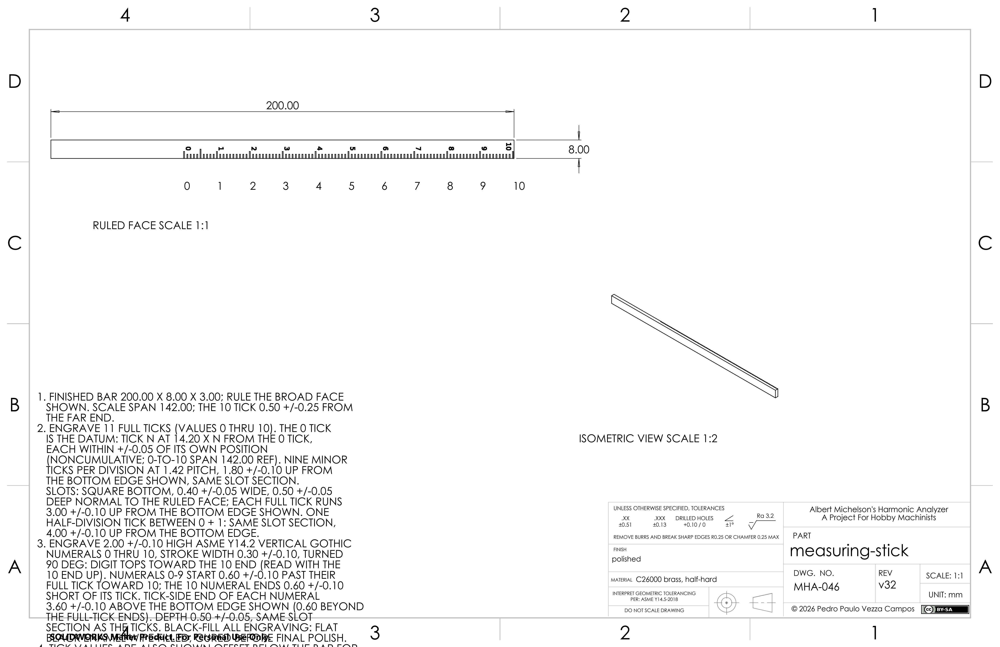
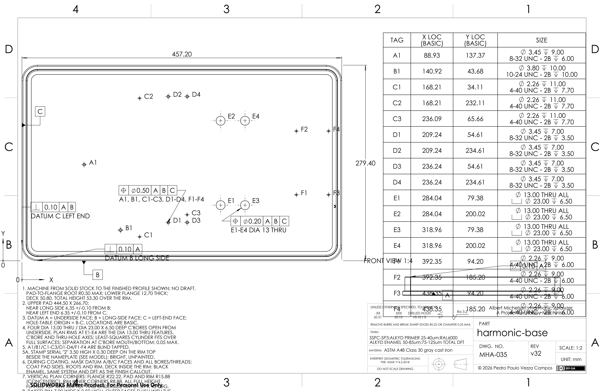

# Drawing print defects from the 3c0 build

Historical evidence for follow-up, not a fix or a native acceptance result. The
[project board](https://github.com/users/pedropaulovc/projects/1) owns current work.

Two of the 51 successfully saved drawing sheets lose manufacturing-note content
at the page edge. The images below are unmodified production PNGs, including the
original watermark. They are retained for the content-loss issue; other
presentation findings are listed in the audit for follow-up under
[#451](https://github.com/pedropaulovc/harmonic-analyzer/issues/451).
The blocking content loss is tracked in
[#712](https://github.com/pedropaulovc/harmonic-analyzer/issues/712).

## Measuring-stick

The note block crosses the lower sheet border and watermark, then is clipped by
the actual page edge. Extractable PDF text includes the lower instructions, but
those strings are not fully visible on the printed page.

## Harmonic-base

The manufacturing notes are clipped at the actual page bottom. Hole-table rows
F1 through F4 overlap the lower-right view, annotations and title area. The
DATUM B LONG SIDE caption also lies across model outlines.

## Provenance and limits

- Producer: `3c0c4a97e69ead5f04fa760b8aa507c16143172d`; adapter
  `25bc99b1ae39d8c0e004867e9b5c0f2068f2abc2`.
- Run started 2026-09-08 00:13:37 UTC. The successful-task set was frozen at
  02:15:03.0402156 UTC. The full run ended with arbor_pedestal no_fit.
- All 51 sheets were viewed individually. All 51 PDFs contain one page and their
  independent 300 dpi PDFium previews match the production PNGs, reproducing
  only the existing 5100×3301-to-5100×3300 rounding crop.
- All 153 native/PDF/PNG files retained identical SHA-256, size and mtime between
  02:17:51.3968311 and 02:28:59.7941270 UTC. No native document was reopened or
  changed by this audit.
- [audit.json](audit.json) contains all 51 task/build trace identities, intervals,
  observations, before/final file hashes, and the two PDFs' extracted text.
  Local paths identify the original files; they are not portable download links.
  Only the two PNGs on this page are bundled here.

Regression attribution remains unknown. Against
`55056d4990d38ebb461f343d3002fc90731b9e73`, the measuring-stick and harmonic-base
builders/specs and their local note/table placement calls are unchanged. The
shared note and hole-table function ASTs are also unchanged, but the factory,
finalizer and binary template changed. Static equality is not a native baseline;
this audit did not compare a same-source print pair across those revisions.

The remaining sheets have a mix of readable layouts, concrete text/leader or
title-cell collisions, and unresolved dense or low-contrast details. Successful
task completion and visible numbers do not certify complete manufacturing intent,
attachment identity or cold persistence. This evidence branch requests no new
native run or merge acceptance.

## Bundled image identity

| Image | SHA-256 |
|---|---|
| measuring-stick_drawing.png | `a826ab15c5e955e81452bf39154040f8493e8c51a809453eced84b88a9d8d123` |
| harmonic-base_drawing.png | `ad36202a0d474faf60a789c97ce9f4d41818f2c5ddd6798858970a4ec016337d` |

Both files were copied byte-for-byte after checking their source hashes against
the guarded bank; source and destination hashes were checked again after copying.
