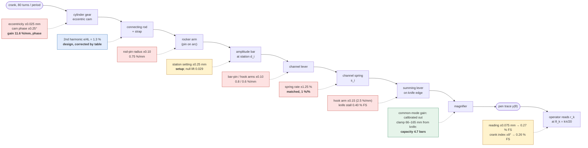
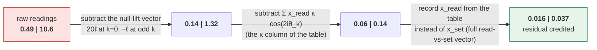
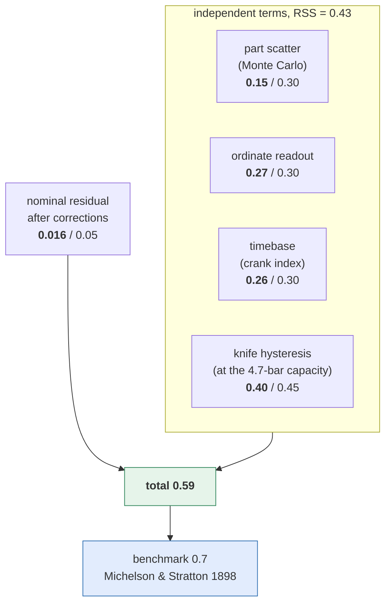
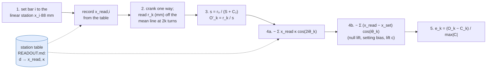

# Tolerance & fits policy

Tolerance is part of the **design source**, not a late drawing annotation. Because the output
is a force balance, *inconsistent* fits across the 20 channels bias the equilibrium rather than
just adding noise — **channel-to-channel consistency matters more than absolute precision**.
Fits are therefore shared parameters applied uniformly, never per-part magic numbers.

## Source of truth

Fit classes and clearances live in [`cad/config/tolerances.yaml`](../config/tolerances.yaml)
and flow into geometry and into part custom properties. The build scripts read named fit
classes; they do not hardcode clearance numbers.

Accuracy-driven limits on the **critical features** live in
[`cad/config/error_budget.yaml`](../config/error_budget.yaml) and are derived — not asserted —
by the sensitivity model [`cad/scripts/error_budget.py`](../scripts/error_budget.py)
(`uv run python cad/scripts/error_budget.py`; gate `check:budget`,
[`test_error_budget.py`](../scripts/test_error_budget.py)). Every number quoted below comes
from that report; regenerate it rather than trusting the prose.

**What this buys, concretely:** every individual part tolerance on a critical feature can be
traced to a number. Ask "why ±0.025 on the cam eccentricity, why ±1.25 % on the springs,
why ±0.10 on a lever arm and not ±0.05?" and the answer is the sensitivity table, the Monte
Carlo row and the allowance — not a habit. That was the goal of the exercise, and the
per-feature answer is the "Result" section below. The readout procedure turned out to be a
necessary part of the same answer (a tolerance is only meaningful against the accuracy the
machine can reach, and most of that accuracy lives in how the trace is read); it is
explained for the operator in [`device-operation.md`](./device-operation.md), with the
1898 provenance for each step, and shipped as a **manufacturing output**: `error_budget.py
--procedure` renders it from the same model and `cut_release` ships it as `READOUT.md` in the
bundle root (the stick drawing's note 5 points at it), so a builder working from the release
has the station table and every correction, not just the drawings.

The whole-device performance benchmark that constrains this allocation is
[`michelson-1898-trial-accuracy.md`](./michelson-1898-trial-accuracy.md):
approximately 0.7% full-scale mean absolute coefficient error on the historical
80-element machine, largest tabulated difference 2.0%. It is a comparison value, not a
demonstrated target for this project's 20 channels, and it is an assembled-machine output
result, not a percentage to apply to part dimensions. This document is the method that turns
it into dimensional limits.

## How a critical-feature tolerance is decided

A feature earns a tolerance tighter than its title-block general grade only through this
chain; a limit that cannot cite each step is a habit, not a requirement.

1. **Name the transfer quantity** the deviation perturbs: channel *gain*, channel *phase*,
   the *ordinate* setting, *hysteresis/deadband* in the force-summed path, or *readout*.
   A deviation that perturbs none of these (a cosmetic profile, a clearance on a
   one-sided-loaded joint) is not an accuracy feature; it gets a fit class or the general grade.
2. **Classify the deviation.**
   - *Common-mode* — the same on every channel (magnifier ratio, counter-spring rate, a
     spring-preload offset, the slide-arc gain curve). Removed by the calibration run and the
     mean-line zero of the readout procedure below. Free.
   - *Setup* — re-introduced by the operator each trial (measuring-stick reading, alignment).
     A procedure limit, not a machining limit.
   - *Channel-specific* — scatters independently per channel and enters the sum directly.
     This is the only class a **part** tolerance controls.
3. **Compute the sensitivity** — ∂(channel gain)/∂(feature) from the transfer function
   (table below), verified against finite differences of the exact kinematics.
4. **Convert scatter to coefficient error** by Monte Carlo through the readout procedure on the
   reference inputs, in % of the greatest term. Random per-channel gain scatter of σ is
   averaged down to roughly σ/√(2m) over m active channels for a broad spectrum, but shows
   up almost undiluted for a sparse one — so both a broad and a two-channel input are scored.
5. **Allocate** against the benchmark. The channel-specific scatter of every critical feature
   combined may consume at most `targets.scatter_mae_fs_pct` (0.30 % of the 0.7 %); the rest
   is reserved for the nominal-design residual, hysteresis and readout, which are not part
   tolerances. Then compare the derived limit with what a hobby shop and its instruments can
   hold and inspect; if capability is the binding constraint, change the *design* (matching,
   adjustment, calibration) rather than writing an unholdable number.
6. **Pick the drawing limit** as the tightest of (a) what accuracy needs from step 5, (b) what
   the fit class needs (a running fit only exists if the size limits are narrower than the
   clearance band), (c) what the process needs (wall, thread, wear) — and never tighter than
   the tightest of those. The report's `allowable` column is the accuracy bound alone.
7. **Verify on the assembled machine** with the trials in the last section; the model is a
   prediction until a trial confirms it.

### The chain, and where each error enters

Red = channel-specific part tolerances (the Monte Carlo); yellow = setup/readout terms the
procedure bounds; blue = the nominal design's own distortion, removed by the correction table;
green = common-mode, removed by normalisation. Sensitivities and sizes are the report's.

## Transfer function and error model

The machine draws, with magnifier gain $G$,

$$
y(\theta) = G\sum_{i=1}^{20} w_i\, u_i(\theta),\qquad
u_i(\theta) \approx K\, d_i \cos(i\theta + \varphi_i),\qquad
w_i = \frac{s_i a_i}{\sum_j s_j a_j^2 + S b^2},
$$

where $d_i$ is the amplitude-bar station (the ordinate), $K = (\text{hook}/\text{bar-pin})\cdot
e/r_\text{pin}$ = 0.0907 mm of spring-hook motion per mm of station (cam throw
$e$ = 8.64, rod-pin radius $r_\text{pin}$ = 133.3, lever arms 177.8/127.0), $s_i$ the channel
spring rate, $a_i$ its hook's moment arm on the summing lever (39.85), $S$, $b$ the counter
spring (76.2). Coefficient $k$ is read at $\theta_k = k\pi/20$. A channel's *gain* is
$g_i \propto e_i\, s_i\, a_i \cdot(\text{hook}/\text{bar-pin})/r_{\text{pin},i}$; its *phase*
$\varphi_i$ is the cam-lobe angle relative to the common alignment. The denominator is
common-mode.

**Gain sensitivities** (% of channel gain per mm, spring per %; analytic | finite-difference
on the exact kinematics):

| feature | nominal | sensitivity | note |
|---|---:|---:|---|
| cam eccentricity `cylinder_gear_spec.ECCENTRICITY` | 8.64 | +11.57 \| +11.55 | the only dimension with a double-digit sensitivity |
| rocker rod-pin radius `rocker_arm_spec.ROD_HOLE_X` | 133.07 | −0.75 \| −0.75 | |
| channel-lever bar-pin arm `channel_lever_spec.BAR_PIN_X` | 127.0 | −0.79 \| −0.76 | |
| channel-lever spring-hook arm `channel_lever_spec.LEVER_SPRING_X` | 177.8 | +0.56 \| +0.56 | |
| summing-lever hook arm `summing_lever_spec.HOLE_X` (normal to the knife line) | 39.85 | +2.51 | hole position across the plate; the along-knife pitch is irrelevant |
| channel spring rate | 2.13 N/mm (derived) | +1.00 %/% | numerator only: the spring's share of the common denominator is calibrated out (below) |
| rocker slide radius, rod length, cam OD roundness, gear runout | — | < 0.1 %/mm | DC or 2·i harmonic only; not gain |

Phase: 1° of cam phase = 1.75 % of that channel's amplitude at the readout points where
$\sin(i\theta_k)=\pm1$. Gear tooth errors convert at the *driven* gear's radius (a 0.02 mm
flank error on any cone gear is 0.02/30.6 rad = 0.04° of the cylinder gear), so tooth
accuracy is not a phase driver; cam-lobe-to-notch registration and one-directional backlash
lag are.

### The nominal design has a residual before any tolerance

The exact kinematics (eccentric + rod on the rocker's −X crank side + rocker pin on an arc + the
rigid 801.95 mm bar whose notch-roof contact rides the R800 slide on the +X side + lever arc,
exactly `build_channel_assembly._arc_geometry` / `solve_state`) are not a pure cosine. From the
report (gain measured from the null station; the sign is the machine-hand convention — the lobe
lifts the crank side, so a +X bar reads negative at the top of stroke):

| station (mm) | gain / linear | 2nd harmonic / fundamental |
|---:|---:|---:|
| +88 | −1.025 | 1.4 % |
| +44 | −1.015 | 1.7 % |
| +22 | −1.012 | 1.9 % |
| +10 | −1.011 | 2.5 % |

Stations are non-negative: the built CAD keeps every bar on the lifting side of the pivot
(`build_channel_assembly` rejects `amplitude_mm < 0`), so a signed input function is **lifted by a
constant** before analysis and the constant's lift vector ($20c$ at k = 0, $-c$ at odd k under
the 20-element rule) is subtracted from the readings. The ledger's "opposite end = 180° phase reversal" is not a mode of the
CAD as built and is not budgeted.

- **Slider-crank distortion**: rod/throw ratio $e/L$ = 8.64/163.1 gives a second harmonic of
  $\approx e/4L$ = 1.3 % of each channel's amplitude, 1.4 % at full scale rising to 6.5 % at an
  idle bar once the arc geometry is added (the idle bar's small fundamental makes the ratio
  large). It aliases onto every readout point (channel 20's 2nd harmonic is +1.5 % at *all*
  $\theta_k$), so uncorrected it costs 0.1–0.2 % MAE and 1.3–1.5 % max on broad inputs and
  1.1 % MAE / 3.0 % max on the two-channel input — larger than every machining term combined.
- **Null station −2.58 mm** (foot-axis x from the pivot): the notch roof touches the arc
  3.175 mm from the foot axis (`amplitude_bar_spec.BAR_WIDTH/2`) and the arc's low point sits
  8 mm above the pivot centreline, so a bar at the geometric zero still moves — 18 idle bars at
  "zero" add a coherent 2.9 %-of-full-scale error each (up to 24 % max on a two-channel input if
  it is ignored). The null station is on the side of the pivot the CAD cannot build, so it is
  **not** where the stick zero goes; because the gain from the null is linear to 0.2 % over the
  range, every bar reads as ordinate $(d_i - d_0)/d_\text{max}$ — a **known common lift of
  0.029** on every channel. Under the machine's own 20-element rule a constant lift $\ell$ reads
  as $20\ell$ at k = 0 and $-\ell$ at every **odd** k ($\sum_{i=1}^{20}\cos(ik\pi/20) = -1$ for
  odd k, 0 for even k ≥ 2), so the correction is a fixed vector subtracted from every trial —
  not a k = 0 adjustment alone (ignoring the odd-k term would leave 0.2 % on a broad input and
  2 % on the two-channel case).
- **Gain non-uniformity** 1.0 % to 2.5 % across the range, once measured from the null station —
  large enough that a millimetre-ruled stick is wrong by up to 0.06 % MAE / 0.33 % max on the
  Gaussian input. The stick stays a linear rule (14.20 mm per division, as engraved); bars are
  set to linear stations and the ordinate each one *reads* is a **table lookup** in the shipped
  `READOUT.md`, subtracted as a read-vs-set vector — the correction Michelson built into his
  "hand stamped, unevenly spaced" stick.

All three are deterministic functions of the design, so they are removed by procedure, not by
tolerance (readout section below). With the calibrated stick, the read-vs-set vector subtracted
and the second-harmonic correction applied, the nominal residual falls to ≤ 0.02 % MAE / 0.09 %
max on every reference input — the "+cal stick" column of the report.
Lengthening the rod would remove it by design but is not photo-faithful; the correction is the
period-appropriate answer (the machine computes, the operator corrects a known table).

What each correction in `READOUT.md` removes, on the nominal (perfect-parts) machine, % MAE of
the greatest term (Gaussian input | two-channel input):

## Result: the budget for the critical features

Monte Carlo of [`error_budget.yaml`](../config/error_budget.yaml) (4000 draws, every feature
uniform within ± tolerance per channel, applied to each bar's **physical hook waveform** at its
station — so a gain error scales the channel's second harmonic and a phase error rotates it, and
the operator's fixed κ correction leaves δ·κ in the scatter — then through the shipped readout;
every bar at the physical amplitude its station reads — an idle bar's ≈ 0.028 of motion is perturbed by its own channel's
deviations too), % of the greatest term. "broad"
pools the all-ones, half-rectangle, Gaussian and lifted-square (odd channels on) inputs; "pair" is channels 1 and
20 alone, the consistency stress case. `allowable` is the tolerance at which the feature
*alone* would consume 0.05 % MAE or 0.5 % pair-p99, the equal-share allocation.

| feature | ± limit | broad MAE | broad p99 max | pair p99 | allowable | how it is held |
|---|---:|---:|---:|---:|---:|---|
| cam eccentricity | 0.025 mm | 0.026 | 0.14 | 0.27 | 0.047 | offset-turn in a 4-jaw, indicate the throw |
| rocker rod-pin radius | 0.10 mm | 0.007 | 0.04 | 0.07 | 0.73 | DRO/CNC hole position |
| lever bar-pin arm | 0.10 mm | 0.007 | 0.04 | 0.07 | 0.70 | DRO/CNC hole position |
| lever spring-hook arm | 0.10 mm | 0.005 | 0.03 | 0.05 | 0.97 | DRO/CNC hole position |
| summing hook arm | 0.15 mm | 0.034 | 0.18 | 0.35 | 0.22 | ½ of the 0.30 pattern-position zone |
| **spring rate** | **1.25 %** | **0.113** | **0.60** | **1.15** | 0.54 | **matched by measurement** — spec-sheet `SET QC`: two hanging loads at eye c-c 60/70, bin from stock (±10 %) |
| cam phase | 0.25° | 0.039 | 0.21 | 0.23 | 0.32 | on the cylinder-gear drawing's native `NotchPhase` angular dimension (lobe axis to notch radial, 1.50° ± 0.25°) |
| mesh lag spread | 0.14° | 0.022 | 0.12 | 0.13 | 0.32 | derived from the 0.05–0.20 backlash band |
| station setting (setup) | 0.25 mm | 0.082 | 0.46 | 0.53 | 0.15 | stick drawing note 5: interpolate to 1/5 of the 1.42 minor division (0.28 step) — what the released stick can deliver; bars at the stick zero / travel stop are one-sided and their mean bias is recorded, not scored. **Scored at the ordinate scale the pen forces** (broad inputs at 0.2–0.5 of full scale, see the magnifier below), where a fixed 0.25 mm is 2–5× the share it is at full scale |
| **all combined** | | **0.154** | **0.81** | **1.50** | | targets 0.30 / 1.5 / 2.0 |

The budget closes with a factor of two in hand on the broad inputs and just inside the
two-channel consistency target. Read it as follows.

- **The spring is the tolerance problem, not the machining.** At ±1.25 % matched it is the largest
  part term (station setting, a setup term, is second at the pen-forced ordinate scale); stock springs at ±10 % would alone give ~0.8 % MAE and ~9 % worst-case on sparse
  spectra — more than the whole benchmark. The matching requirement is a manufacturing output:
  the spring spec sheet's `SET QC` note (`channel_spring_installed_notes.DRAWING_NOTES`,
  pinned by `check:budget`). Match first; the adjustable-hook alternative (a slotted spring
  hole on the channel lever, 0.56 %/mm) is the fallback if a batch cannot be binned, and
  departs from the photographs.
- **The eccentricity limit is capability-driven, not accuracy-driven.** Accuracy alone allows
  ±0.048 mm; the drawing's ±0.025 (`cylinder_gear_spec.DRAWING_NOTES`) is kept because an
  indicated offset in a 4-jaw reads to 0.01 mm and costs nothing extra. Relaxing to ±0.05 is a
  legitimate decision (it consumes 0.05 % MAE); `check:budget` pins the drawing note to the
  yaml so the two cannot silently diverge.
- **The lever arms need no `precision` grade for accuracy**: at the general ±0.10 they use 1/7
  to 1/10 of their allowable. Their bores still carry the `shaft_in_bushing` fit, which is
  what the tighter size limit on the *bore* is for.
- **Summing-lever hole position is the one plate feature that matters** (2.51 %/mm across the
  knife line). Drill the 20 holes from one fixture; the along-knife pitch can be loose.
- **Phase is cheap if lobe and notch are cut in one setup.** ±0.25° is 0.13 mm at the notch.
  Crank in one direction only; a reversal re-seats every mesh on the other flank
  (0.05–0.20 mm backlash = 0.09–0.37° at the 120T pitch radius).
- **Every clearance in the position-driven chain is benign under one-sided load** — strap on
  cam, rod pin, rocker pivot, bar foot, top pin, spring hooks — because the channel spring
  preloads the whole chain in one direction for a station of fixed sign. The strap's
  0.20 mm diametral clearance would otherwise be a 2.3 %-of-amplitude step: it becomes a DC
  offset the mean-line zero removes. Fit classes on these joints exist to prevent binding, not
  for accuracy; do not tighten them in the name of accuracy.

### Terms the budget reserves outside the part tolerances

| term | size | what it depends on | controlled by |
|---|---|---|---|
| term | assumption (`error_budget.yaml reserved:`) | value | allowance |
|---|---|---:|---:|
| nominal residual after correction | table-lookup setting + read-vs-set vector + 2nd-harmonic correction (all in the shipped `READOUT.md`) | 0.016 % MAE | 0.05 |
| ordinate readout | the CAD's **15 mm half-stroke** (`output.yaml pen_trace_half_mm`, asserted by `verify:kinematics`) read to ±0.075 mm (half a 0.15 mm technical-pen line against the grid), with the k = 0 (greatest) term made to span the stroke — Michelson's normalisation (book p. 99: "scaled by adjusting the magnifying lever"). **The magnifier is derived, not assumed** (`closed_form.magnifier`): the clamp's reachable radius on the magnifying lever runs from the bracket collar face (66 mm from the knife) to the as-built pose (165 mm; `magnifying_lever_geom.clamp_radius_band`, asserted by `build_magnifier_assembly`), the spring coupling puts the hook row at the mean hook displacement, and the wheel's rim/hub wire ratio is 4.76 — so one full-scale bar moves the pen 3.18 mm even at the minimum setting, and the bars' read ordinates can sum to at most **4.72 (the ordinate capacity)** before the k = 0 peak overruns the stroke. Every broad reference input exceeds it and is run at a reduced ordinate scale (all-ones 0.21, half-rectangle and lifted square 0.42, Gaussian 0.51; the two-channel case fits at 121 mm); the setting and knife terms pay for that, this term does not. One reading converts through the procedure's own identity $s = r_0/(S + C_2)$, so it is $\delta\,(S + C_2)/(r_0\,\Sigma x)$ — the idle bars' lift and the second harmonic riding the peak both inflate it — and every coefficient carries **two** independent reads: its own and the k = 0 normaliser's, the latter scaled by the *physical* $a_k = r_k/r_0$. Scored as the **MAE** the benchmark and the other terms use — for uniform ±δ reads $E\lvert\delta_k - a_k\delta_0\rvert = \delta(1/2 + a_k^2/6)$, averaged over k — on the worst broad input: 0.27 % on every broad input, 0.33 % two-channel. The **worst single coefficient** is a √(1 + a_k²) bound — 0.73 % on the lifted square, whose k = 20 term is 0.84 of its k = 0 — reported (`pct_fs_worst_coefficient_bound`), not gated | 0.27 % MAE | 0.30 |
| timebase | read coefficient k with the crank stopped on its index at 2k turns, index repeatable to ±8° (uniform). Scored on the **physical trace through the procedure**: the pen read at $\theta_k + \delta$ while the second-harmonic and read-vs-set corrections stay at $\theta_k$ (`NominalTrial.readout(theta_error=…)`, so live idle bars, calibrated ordinates and the CAD's own harmonics all enter the slope), RMS over k and the uniform band, worst reference input (the lifted square), each input at the ordinate scale the pen forces. The ideal-vector slope $-\sum i x_i \sin(i\theta_k)$ gives 0.254 there against the physical 0.261 (the hook motion's harmonics are a larger share at small stations; on the two-channel case 0.059 vs 0.035) — vs 1.24 % FS per 0.1 mm of abscissa at the CAD's 1.596 mm/turn feed (`paper_drive_geom`), 0.31 % with the coarse T24/T12 set | 0.26 % FS | 0.30 |
| knife-edge hysteresis | hardened edge on a hardened seat, rolling-resistance length 0.005 mm at the derived 2.3 kN edge load — the 20 channel preloads (1.5 kN) **plus** the counter spring's balancing reaction (0.8 kN at the 76.2 mm arm), both bearing on the knife (3.4 % of one channel's stroke per 0.01 mm). The stall is a fixed displacement, so against a trial's greatest term it is 1.7 % / (scale × Σx) — and the pen caps every broad input at the same 4.7-bar capacity, so **all four read 0.40 %** (0.09 % if all-ones could run at full scale), 0.86 % on the two-channel case. **The capacity, not the edge, is what this term buys**: a clamp band reaching nearer the knife or a longer pen stroke halves it; *measure* as trace width on a slow reversal | 0.40 % FS | 0.45 |
| **total** | residual + RSS(scatter 0.154, readout, timebase, knife) | **0.59 % MAE** | **0.7 benchmark** |

`check:budget` fails if any term overruns its allowance or the total overruns the benchmark, so a
coarser reading or a duller knife cannot be hidden behind a green scatter result. **The knife
term is now the largest, and it is the magnifier's doing**: the clamp cannot get nearer the
knife than the bracket collar (66 mm), so the pen's 15 mm half-stroke holds at most 4.7
full-scale bars of read ordinate — every broad input is set at 0.2–0.5 of full scale, and the
knife stall, the stick's 0.25 mm and the idle bars' lift are all 2–5× the share they would be at
full scale. **Readout and timebase are next** — the readout's worst single coefficient at the
15 mm stroke is 0.6–0.7 %, Michelson's own table quantisation, and it is why the paper's 0.7 %
is hard even with perfect parts. The design levers, both outside machining: a clamp band that
reaches ~15 mm from the knife (the collar moved or the clamp passing it) or a longer pen stroke
(a CAD/`verify:kinematics` change to `pen_trace_half_mm`); either raises the capacity and
shrinks knife, setting and readout together (#748).

How the 0.7 % benchmark is spent (all % of the greatest term, MAE; independent terms combine
root-sum-square, the systematic residual adds):

Each node shows **value** / allowance (`error_budget.yaml reserved:` and `targets:`). The part
scatter box is the only one machining controls; within it the spring rate is 40 % and the
eccentricity and summing-hole position most of the rest (table above).

## Readout and calibration procedure (what the model assumes)

The Monte Carlo and the residual numbers above hold only under this procedure; it is part of
the specification.

$S = \sum_i x^\text{read}_i$ and $C_2 = \sum_i x^\text{read}_i\kappa_i$ are the two sums the
operator forms from step 1; the table is the only data the procedure needs beyond the readings.

1. **Zero the measuring stick at the pivot** (every station ≥ 0, the only side the CAD builds)
   and **set each bar to its linear station** $x_i \cdot 88$ mm on the engraved 14.20 mm/division
   scale, then **record the ordinate it actually reads** from the station table in the shipped
   `READOUT.md` (verify the table on the assembled machine from single-channel runs: one bar
   alone at each station, its k = 0 amplitude as a fraction of a full-scale bar's). The read
   ordinate differs from the set one — an idle bar at the stick zero reads $\ell$ = 0.029, not
   0 — and that difference is what the correction subtracts. Every trial then carries the read-vs-set vector
   $\sum_i (x^{read}_i - x^{set}_i)\cos(ik\pi/20)$ — for idle bars $20\ell$ at k = 0, $-\ell$ at
   odd k, 0 at even k ≥ 2 — subtracted from every reading (in ordinate units, after
   normalising). Graduate or
   calibrate the stick from single-channel runs, not from a ruler — the gain deviates from
   linear by 0.9–1.1 % across the range (table above), and Michelson's own stick was "hand
   stamped, unevenly spaced" for the same reason. Set each bar by interpolating to 1/5 of the
   stick's 1.42 mm minor division (stick drawing note 5): a 0.28 mm step gives ±0.14 mm
   rounding, ±0.25 mm with eye and parallax — the budget's setting term. A bar at a zero
   ordinate cannot be set below the pivot, so its setting error is one-sided [0, +0.25]: on
   average it stands at +0.125 mm, so **record its read ordinate at that station** (0.0294,
   not the table's 0.0281 at 0) — a lift of the same kind as the null lift, removed by the same
   read-vs-set vector, so only the scatter about it survives; a full-scale bar is one-sided the
   other way, [−0.25, 0] against the travel stop, recorded at 87.875 mm (0.9986). `READOUT.md`
   prints both numbers; the Monte Carlo samples both one-sided bands and subtracts the same
   means.
2. **Normalise each trial by its own k = 0 reading** in the units the operator has: with
   $S = \sum_i x^\text{read}_i$ and $C_2 = \sum_i x^\text{read}_i\kappa_i$ (both ordinate-unit
   sums from step 1) the k = 0 pen reading is $r_0 = s\,(S + C_2)$, so the trial's pen scale is
   $s = r_0/(S + C_2)$ and every reading becomes $r_k/s$ — Michelson's normalisation to the
   greatest term, with no internal unit needed (`READOUT.md` step 3; the model's
   `read_coefficients` is the same arithmetic). This removes all common-mode
   gain, including the magnifier setting, so the magnifier is reset per trial to bring the
   k = 0 term to the full stroke. Its range is finite: with the clamp against the bracket collar
   (66 mm from the knife) the trial's k = 0 peak $P = \sum x^{read}_i(1 + \kappa_i)$ may be at
   most 4.72 full-scale bars — a broader function is set at the largest scale $f$ with
   $P(f) \le 4.72$, solved from the station table, *not* by proportion: the idle bars' read
   ordinate is fixed, so $P$ is affine in $f$ and proportion overdrives the stroke ~9 %
   (`READOUT.md` step 1 ships the rule and a $P(f)$ check table).
3. **Lift signed inputs**: every bar stays on the lifting side of the pivot (the CAD realises
   no negative station), so add a constant $c$ to a signed function before setting the bars and
   subtract its lift vector ($20c$ at k = 0, $-c$ at odd k) from the readings, exactly as for
   the null lift.
4. **Mean-line zero**: for each trial, take the zero as the mean of the trace over one full
   period, not the pen's neutral position. This removes the one-sided-swing DC, spring-preload
   scatter, strap-clearance offsets and tare drift in one step.
5. **Second-harmonic correction**: subtract $\sum_i x^\text{read}_i\,\kappa_i \cos(2 i\theta_k)$
   from reading $k$, with $\kappa_i = c_2/c_1$ the per-station ratio from the report (or
   measured: run channel 20 alone;
   $\kappa = (r_\text{even}-|r_\text{odd}|)/(r_\text{even}+|r_\text{odd}|)$ over its
   alternating readings). Use the **read** ordinate, not the set one: an idle bar still moves
   (its $c_1$ is the null lift), so its second harmonic is $\kappa\,x^\text{read} \neq 0$ — on
   `pair_1_20` the 18 idle channels' $c_2$ is what the correction removes.
6. **Crank in one direction**, and read coefficient $k$ with the crank stopped on its index at
   $2k$ turns (the 80-turn period makes $\theta_k = k\pi/20$ exactly two turns apart) rather
   than at a ruled abscissa on a moving paper.
7. Report errors as $e_k = (O_k - C_k)/\max_j|C_j|$ with $C_k$ computed by the **same
   20-sample rule** the machine realises, so quadrature error is never charged to the hardware.

## Assembled-machine verification (which trial detects which feature)

| trial | procedure | detects | pass |
|---|---|---|---|
| channel consistency | each bar alone at full scale, read the k = 0 amplitude | spring rate, eccentricity, arms, summing holes (gain scatter) | every channel within ±2 % of the mean (the budget's combined worst case is ±2.1 %); an outlier is a spring to swap |
| channel phase | same runs, zero-crossing position vs. expected | cam-to-notch, mesh lag | ≤ 0.4° each (0.25° + 0.14° budgeted) |
| hysteresis | one bar at full scale, crank forward then back slowly | knife edge, wheel bearing, wire preload | proposed: trace width ≤ 1 % of that channel's stroke (an edge rolling-resistance length ≤ 0.005 mm at the derived load) |
| station table check | one bar alone at each station, k = 0 amplitude vs a full-scale bar | slide-arc height, contact offset, gain curvature | matches the `READOUT.md` table; idle bar reads ≈ 0.029; subtract the read-vs-set vector (20ℓ at k = 0, −ℓ at odd k) from every trial |
| broad-input benchmark | Michelson's Gaussian ($e^{-(0.1i)^2}$) and half-range rectangle, corrected readout | everything | MAE ≈ 0.7 %, max ≈ 2 % of the greatest term — historical parity |
| sparse-input stress | channels 1 and 20 alone | consistency without averaging | worst coefficient ≤ 2 % |

## Fit classes (interfaces that must carry a rule)

| Interface | Class | Intent |
|---|---|---|
| shaft ↔ bushing (crank/rocker/lever pivots) | running clearance | hand-cranked, low-speed → generous slip fit, beginner-safe |
| gear ↔ gear mesh (cone↔cylinder, platen rack) | backlash | zero-backlash-in-CAD gears bind in brass |
| cam ↔ follower / connecting rod | contact clearance | follower rides without jamming at dwell |
| amplitude bar ↔ rocker | sliding side clearance | bar slides without binding through full sweep |
| fastener ↔ clearance hole | close / normal | per fastener class |

None of these is an accuracy feature (see the one-sided-load argument above); their limits are
set by binding, wear and assembly, and the size limits on the mating features must be narrow
enough to deliver the band ([assessment §4](./tolerance-gdt-assessment.md)).

## Verification gates

`verify.py` runs a **tolerance audit** (and writes `cad/out/reports/tolerance_audit.csv`) that
fails the build if any part lacks material / tolerance class / process, or any moving interface
lacks a fit class. This is the Gate-E pass. `check:budget` fails the build if the sensitivity
model disagrees with the exact kinematics, a toleranced nominal no longer resolves to the spec
constant the CAD builds from, a drawing limit disagrees with the budget, or the Monte Carlo
leaves its targets.

## Current analytic clearance assertions (kept, being migrated)

The build scripts already assert clearance margins analytically (and raise on violation) — these
are the concrete realizations of the classes above, being lifted into `tolerances.yaml`:

- spring-eye threading margins into the lever hole / under the tab;
- oblique cone↔drum mesh penetration guard (edge slack);
- rack–pinion backlash;
- bushing clearance under the amplitude-bar foot.

## Open items the budget exposed

- **The spring pair is unbalanced as modelled — the machine has no static operating point.**
  The 20 channel springs at their derived 2.13 N/mm × 35.8 mm preload pull 1.5 kN on the
  39.85 mm arm; balance needs 0.8 kN from the counter spring on the 76.2 mm arm, and the CAD's
  counter spring (0.51 N/mm, at most ~28 mm of extension in its 325.3 mm installed body) can
  supply ~15 N — a 50× shortfall. Every rate here is derived from wire geometry (low
  confidence), so the resolution is a spring specification, not a budget change: either the
  channel preload is far lower than the modelled stretch implies (a longer free length), or the
  counter spring is far stiffer, or both. `check:budget` reports the imbalance and fails on it
  unless `reserved.knife.waive_static_balance` is set; the waiver is set, and **the closure
  above is conditional on resolving this**. The knife term is computed at the balanced load.
- **Magnifier range / ordinate capacity** (#748): the budget derives the pen scale from the
  CAD — spring coupling 0.958, lever radius 66–165 mm (collar face to as-built), wheel ratio
  4.76 — and finds one full-scale bar moves the pen 3.2 mm at the *minimum* setting, so the
  15 mm half-stroke holds 4.7 bars of read ordinate. The book's "up to 4×" is the as-built
  165/39.85; `output.magnify_factor` 4.0 stays the kinematic-probe convention. The wire route
  at the minimum radius is not gated (the clamp face touches the collar face; the vertical rod
  hangs 6 mm forward of the collar). Raising the capacity — a clamp band reaching ~15 mm from
  the knife, or a longer stroke — is the cheapest remaining accuracy gain: it halves the knife
  term and the setting share together.
- `amplitude.max_travel_mm` 88 vs. the ledger's ±146 mm foot travel: the budget uses 88; a
  larger full scale improves every readout term proportionally.
- The eccentricity drawing limit (±0.025) vs. its accuracy allowable (±0.048): keep or relax
  is a stated decision, pinned either way by `check:budget`.

## Scope of manufacturing outputs

Reassessed in [`tolerance-gdt-assessment.md`](./tolerance-gdt-assessment.md) §11 — nothing here is
left "deferred":

- **GD&T (full, ASME Y14.5-2018), surface-finish specs, critical-feature callouts — IN SCOPE.**
  Held in config, stamped into the model as PMI, imported onto the drawings, audited. The full
  vocabulary is available — form, orientation, location (true position + MMC/LMC bonus), profile,
  and runout, over explicit datum reference frames — applied **functionally**: a feature-control
  frame appears only where the error model rewards it (the knife edge, the cams, channel
  consistency), and a general tolerance block (an ASME decimal-place title-block table; ISO 2768 if
  drawing to ISO) governs everything unspecified. This
  **retires the earlier "lite" cap** that limited geometry to dial-indicator runout on the theory the
  audience couldn't parse frames — the supplement now ships a GD&T primer instead (see assessment
  §1/§5).
- **2D shop drawings — IN SCOPE (planned).** A hobby machinist builds from a dimensioned, toleranced
  print, so generated PDF drawings (Tier-1 precision-critical parts first) are the vehicle that
  carries the tolerances to the bench. Same `SaveAs3` path the STEP/STL export already uses; a new
  `drawing:<stem>` doit task that takes the COM seat lock.
- **CAM (STEP→CAM→G-code) — IN SCOPE, deferred until the nominal model is frozen and validated.**
  The build is manual-primary for fidelity, with the PM-30MV **CNC** cutting the repetitive high-count
  parts (20 cams, 19+19 spacer bushings, cone/cylinder gear train). The primary feed is the **3D solid
  via STEP** (emitted by `SaveAs3` in `export_models.py`/`cut_release.py`) into **Fusion 360**
  (Makers SKU) → G-code; CAM cuts nominal, so the toleranced print carries fits/finish. **Caveat:** the
  neutral export writes one STEP per SLDPRT (active config), so a multi-config part like the 20-config
  `cone-gear` needs a **per-config STEP export path added** before all 20 can be fed to CAM (see the
  assessment §11). Authored after the §4 Findings close. Manual mill + lathe still make every one-off part.
- **DXF — narrow role, NOT the primary CAM feed.** 2D only; used only for genuinely flat parts, 2.5D
  contour/indexed profiles (cam/gear-tooth flanks), and inspection-reference overlays — subordinate to
  the STEP→CAM path (which handles the real 3D solids). Carries geometry, not tolerances.
