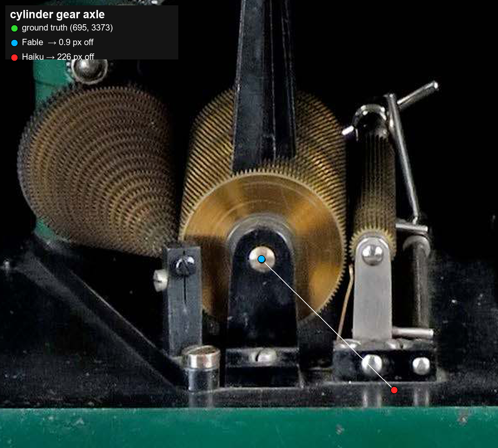

# Can vision models point at gears? Five of them tried.

I gave five frontier vision models the same job: look at eight century-old
photographs of Michelson's harmonic analyzer and drop a dot on specific
mechanical features. The rotation axis of each gear, the four corners of one
rocker arm, the corners of the machine's frame. No edge detection, no OpenCV.
Crop, zoom, look, place the pixel. Everyone got the identical prompt. Then I
scored each dot against a hand-placed ground truth, in pixels.

The contestants: Claude Fable 5, Opus, Sonnet, Haiku 4.5, and Codex / GPT-5.x.
76 visible features across the eight views.

## The scoreboard

| model | marked | median error | ≤10px | ≤50px | false "visible" |
|-------|:------:|:------------:|:-----:|:-----:|:---------------:|
| **fable**  | 52/76 | **22.8 px** | **20** | **29** | 22 |
| sonnet | 48/76 | 30.4 px | 8  | 28 | 21 |
| opus   | 50/76 | 81.3 px | 9  | 24 | 24 |
| codex  | 53/76 | 137.4 px | 6  | 12 | 44 |
| haiku  | 67/76 | 306.0 px | 1  | 2  | 40 |

(Errors after normalizing one left/right convention flip per image; more on that
below.)

## One feature, two very different answers

Here is the cylinder gear's axle in the back view. The exposed silver pin is the
target. Fable's dot lands on it to within a pixel, so the green ground-truth
marker is hidden directly underneath. Haiku's dot is 226 px away, down on the
baseplate.

Both models found the same part. Only one of them looked hard enough to land on
the shaft, and that is roughly the whole benchmark in one crop.

## What came out of it

**Fable was the sharpest.** Best median error, and 20 of its dots landed within
10 pixels, about double the next model. When it committed to a point, it was
usually right on top of it.

**Sonnet was the steadiest.** Its mean error was the lowest in the field (142 px
against Fable's 190), so it had fewer wild misses dragging the average around,
even with a slightly worse median. Fable is the better shot; Sonnet is the one
who never flubs an easy one.

**Knowing when to shut up is a skill.** Look at the last column. Haiku marked 67
of 76 features and got almost none of them right: one dot inside 10 px, and 40
features it swore were visible when they were physically hidden. It hardly ever
conceded that a feature was occluded. In the back view above, it stamped all four
*front* frame corners as visible, and those faces point away from the camera.
Codex had the same reflex in milder form, with 44 false "visible" calls and the
worst occlusion agreement of the group. The models that scored well were the ones
willing to say "can't see it from here" and leave the dot off. Eagerness to guess
tracked inversely with being right.

**Left and right are booby-trapped.** The single biggest accuracy jump came for
free from the scorer, not from any model. The spec asked for "machine-relative"
left and right on the frame corners, and the models genuinely split: some used
the machine's own left, some the viewer's. Allow one consistent mirror per image
and Fable's median drops from 170 px to 23. If the humans writing your labels
would argue about a direction word, the models will too, and the penalty here was
an 800 px jump to the opposite corner.

**One feature was rigged against everybody.** Every model read "pinion" as the
small chain sprocket by the drive gear, which is a fair reading of the spec. The
ground truth put it on a different part. So all five carry a 300 to 500 px error
there that says nothing about how well they see. It says the spec and the ground
truth disagreed. That is the kind of quiet mismatch that makes a benchmark lie if
nobody reads the per-feature numbers.

## Takeaways

- On slow, zoom-in visual localization, Fable leads on precision and Sonnet on
  consistency, and the gap back to the rest is wide.
- Calibrated abstention beats confident guessing. The occlusion column predicts
  the accuracy column. A model that marks everything looks thorough and scores
  terribly.
- Half your benchmark error can hide in the spec. An ambiguous direction word and
  one mislabeled part were the two largest error sources here, and neither is
  about vision.

Method, prompt, and per-feature numbers: `SPEC.md`, `results.md`, `results.json`.
Every model's full annotated views are under `runs/<model>/`.
